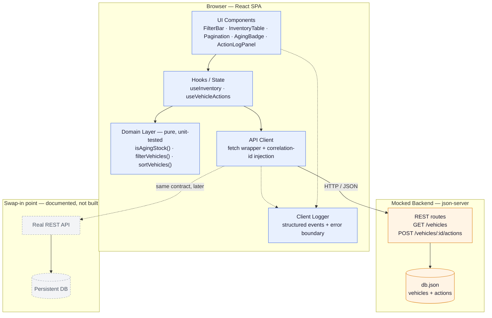

# Keyloop Inventory Dashboard — System Design Document

| | |
|---|---|
| **Scenario** | B — The Intelligent Inventory Dashboard |
| **Domain** | Supply |
| **Service layer implemented** | Frontend (backend mocked) |
| **Author** | Akbar Basha Shaik |

> I work day-to-day in Keyloop's Ownership domain (Service Hub 360,
> Aftersales). I chose Supply deliberately — it let me test my design
> process against a problem I don't already have domain familiarity with,
> rather than leaning on context I'd bring from my current project.

## Contents

1. [Problem Summary](#1-problem-summary)
2. [Assumptions](#2-assumptions)
3. [Architecture Diagram](#3-architecture-diagram)
4. [Component Roles](#4-component-roles)
5. [Data Flow](#5-data-flow)
6. [Requirements Coverage](#6-requirements-coverage)
7. [Technology Choices & Justification](#7-technology-choices--justification)
8. [Observability Strategy](#8-observability-strategy)
9. [GenAI Usage in the Design Phase](#9-genai-usage-in-the-design-phase)

## 1. Problem Summary

Dealership managers need a real-time view of vehicle stock that surfaces
aging inventory (>90 days on lot) and lets them record a follow-up action
against each aging vehicle, so stock that is losing value doesn't sit
unmanaged.

## 2. Assumptions

The brief explicitly invites reasonable assumptions where requirements are
ambiguous. Here are mine, and the reasoning behind each:

| # | Ambiguity | Assumption | Reasoning |
|---|---|---|---|
| 1 | Single dealership or multi-dealership view? | Single dealership, no org/tenant switcher | Keeps scope matched to the time box; a tenant selector is an additive UI change later, not an architectural one now |
| 2 | Is the "aging stock" threshold fixed? | Hardcoded at >90 days per spec, isolated in one pure function (`isAgingStock`) | One-line change to make it a configurable business rule later, without building config UI nobody asked for |
| 3 | "Log and persist a status/action" — single current status, or a history? | Append-only action log per vehicle; current status = most recent entry | "Log" implies a timeline; an overwritable single field would silently discard a manager's prior decisions |
| 4 | Vehicle inventory data source | Static mock dataset with varied `daysInStock` values (several >90), served from a local REST mock | Matches the brief's instruction to mock the backend layer for a frontend submission |
| 5 | Authentication | Out of scope; single implicit manager identity | Not a stated requirement; adding auth adds surface area without demonstrating anything the brief evaluates |

## 3. Architecture Diagram

The API client is the single seam between the app and "the backend."
Swapping the mock for a real service later means changing a base URL, not
any UI or domain code — that boundary is the main scalability decision in
this design.

## 4. Component Roles

| Component | Role |
|---|---|
| **UI Components** | Presentation only. `InventoryTable` renders rows and delegates the aging/not-aging decision to the domain layer rather than computing it inline, so the rule has one home. |
| **Hooks** (`useInventory`, `useVehicleActions`) | Own data fetching, caching, and the loading/error state machine. This is the layer that would change if the app moved from manual `fetch` to something like TanStack Query. |
| **Domain layer** | Pure, framework-free functions: the 90-day aging rule, filtering by make/model/age, sorting, and pagination (`paginate`, `totalPages`). No network, no React — this is what the test suite targets directly, and it's reusable if the logic ever needs to run server-side too. |
| **API client** | Thin `fetch` wrapper that attaches a correlation ID to every request and centralizes error normalization, so every caller gets consistent error shapes instead of each hook handling raw fetch failures differently. |
| **Client logger** | Structured event emission (`inventory_loaded`, `filter_applied`, `action_logged`, `api_error`), plus a React error boundary around the table and action panel so one section failing doesn't blank the whole page. |
| **Mock backend** (json-server) | A real persisted REST contract, not just a static JSON import — a POSTed action genuinely persists and survives a refresh. |

## 5. Data Flow

1. `InventoryPage` mounts → `useInventory()` calls `GET /vehicles` through
   the API client → response cached in hook state.
2. `isAgingStock(vehicle)` runs per row at render/selector time, derived
   from `dateReceived` — not a stored `isAging` flag — so there is one
   source of truth and no risk of a stale flag drifting from the real date.
3. `FilterBar` changes update filter criteria in local state;
   `filterVehicles()` (domain layer) recomputes the visible set
   client-side — no refetch needed for filtering, since one dealership's
   inventory is small. The filtered set is sorted (`sortByDaysInStockDesc`)
   and then sliced into pages (`paginate`) in that order, so
   the oldest stock always surfaces on page 1 regardless of filters; a
   filter change resets the page back to 1.
4. Manager opens `ActionLogPanel` for an aging vehicle, submits a note →
   `POST /vehicles/:id/actions` → json-server appends to `db.json` → hook
   state updates → UI reflects the new log entry and updated "last action"
   immediately.
5. Any network/mock failure is caught by the API client, normalized,
   logged via the client logger, and surfaced as an inline error state
   rather than failing silently.

## 6. Requirements Coverage

Mapping each acceptance criterion from the brief to where it's addressed,
so coverage is verifiable at a glance:

| Scenario B requirement | Where it's addressed |
|---|---|
| **Inventory Visualization** — filterable list (make, model, age) | `FilterBar` + `filterVehicles()` domain function, paginated via `Pagination` + `paginate()` so the view stays fast as inventory grows ([§4](#4-component-roles), [§5](#5-data-flow)) |
| **Aging Stock Identification** — flag vehicles >90 days | `isAgingStock()` pure function, derived from `dateReceived`, rendered via `AgingBadge` ([§2](#2-assumptions) #2, [§5](#5-data-flow) #2) |
| **Actionable Insights** — log/persist a status or action per aging vehicle | `ActionLogPanel` → `POST /vehicles/:id/actions` → persisted in `db.json` ([§2](#2-assumptions) #3, [§5](#5-data-flow) #4) |

## 7. Technology Choices & Justification

| Choice | Why |
|---|---|
| **React 18 + TypeScript + Vite** | TypeScript catches drift between the UI and the mock API contract at compile time; Vite keeps the dev loop fast; React matches the stack already used on Service Hub 360, so the result is stylistically consistent with how Keyloop builds frontends today. |
| **json-server for the mock backend** | Gives a real HTTP + persistence round trip (a POST actually survives a refresh) instead of a static JSON import — more honestly exercises loading/error states and async handling, closer to a real backend integration. |
| **Hooks + local/query state (no global state library)** | The app has one real piece of shared server state (the vehicle list) and simple local UI state (filters). A Redux/Zustand layer would add indirection without solving a problem this app actually has. |
| **Vitest + React Testing Library** | Native pairing with Vite (shared config, fast); RTL's philosophy of testing behavior rather than internals fits testing the aging-stock and filter rules the way a manager would actually encounter them. |
| **Minimal/plain CSS (no full design system)** | Time-boxed exercise — a heavy UI kit would spend budget on polish the evaluation criteria don't ask for, at the cost of implementation and test coverage, which they do. |
| **Client-side pagination** | A single dealership's inventory (tens to low hundreds of vehicles) comfortably fits in memory, so pagination here is a rendering/scroll concern, not a data-volume one — slicing an already-fetched array is simpler and faster than round-tripping to the backend per page. If inventory scale grew past what one fetch should carry, the same `paginate()` call becomes a `?page=&pageSize=` query param against the real API with no UI change, since the component already treats "the current page" as a prop, not as "all the data." |

## 8. Observability Strategy

Since the backend is mocked for this submission, this section states both
what's implemented now and what the equivalent production setup would be.

| Pillar | Status | Approach |
|---|---|---|
| **Logging** | Implemented | Structured logger wrapping `console` with event name + correlation ID + timestamp, for key lifecycle events (`inventory_loaded`, `filter_applied`, `action_logged`, `api_error`) — the client-side half of the same correlation-ID pattern used with New Relic / Azure App Insights on Service Hub 360. |
| **Error isolation** | Implemented | React error boundary around the table and action-log panel, so a rendering failure in one widget doesn't take down the whole dashboard; the boundary logs the failure before showing a fallback. |
| **Metrics** | Documented, not wired | Production would report Web Vitals (LCP/FID/CLS) and a custom business metric — aging-stock count on load — to a RUM tool such as Azure App Insights, matching existing Keyloop tooling. |
| **Tracing** | Documented, not wired | The API client already injects a correlation ID per request; in production that ID would propagate into the backend's distributed trace (e.g., OpenTelemetry/New Relic), so a support engineer could follow one user action from browser log to backend trace. |

## 9. GenAI Usage in the Design Phase

This was an AI-native design process — Claude Code was a core collaborator
from the first draft, not an occasional lookup tool:

- **Ambiguity resolution** — I gave it the scenario requirements and had
  it catalog every place the spec was underspecified, more exhaustively
  than I'd have managed scanning by hand. It surfaced the
  aging-threshold-configurability and single-status-vs-history questions
  in the assumptions above; I made the call on each and it helped draft
  the supporting reasoning.
- **Architecture & diagram drafting** — I described the component
  boundaries I wanted — UI, hooks, domain, API client — and it produced
  the full first-pass architecture, including the diagram. I reviewed it
  layer by layer: one early draft had the domain layer calling the API
  client directly, breaking the no-network-dependency property the
  testability strategy depends on, so I had that boundary corrected.
- **Trade-off analysis** — I asked it to work through json-server vs. MSW
  vs. a static JSON import for the mock backend, and React Query vs. plain
  hooks for data fetching, with the actual trade-offs for this app's
  scope. I accepted the plain-hooks recommendation after confirming the
  reasoning held (one fetch, one mutation — not enough surface area for
  React Query), and overruled a lean toward a global state library "for
  scalability" since this app has no cross-cutting state problem to solve.
- **Document drafting** — this document itself was written collaboratively:
  I set the structure and the requirements each section had to satisfy,
  it wrote the first pass of each one, and I edited for accuracy and
  rewrote sections where the reasoning needed sharpening.

The architecture reflects real AI-driven design work, directed and
reviewed by me at every boundary — that direction-and-review loop, not
withheld trust, is what shaped the final design.
